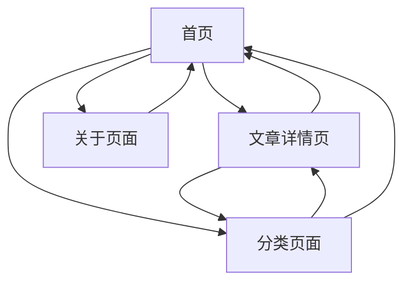

## 1. 产品概述
基于GitHub Pages的个人博客系统，采用现代化简洁设计风格，支持Markdown格式文章发布、分类管理和多媒体内容展示。为个人用户提供一个优雅、易维护的内容发布平台。

解决传统博客平台样式老旧、自定义困难的问题，让个人用户能够轻松创建具有专业外观的个人博客网站。

## 2. 核心功能

### 2.1 用户角色
由于个人博客主要面向单一用户，不设置复杂的用户角色系统。博客管理员通过GitHub仓库直接管理内容。

### 2.2 功能模块
博客系统包含以下核心页面：
1. **首页**：博客文章列表、分类导航、个人简介
2. **文章详情页**：Markdown内容渲染、图片展示、标签显示
3. **分类页面**：按分类浏览文章、标签云展示
4. **关于页面**：个人信息、联系方式、技能展示

### 2.3 页面详情
| 页面名称 | 模块名称 | 功能描述 |
|---------|---------|---------|
| 首页 | 文章列表 | 展示最新博客文章，包含标题、摘要、发布时间、分类标签 |
| 首页 | 分类导航 | 显示所有文章分类，支持点击筛选 |
| 首页 | 个人简介 | 展示博主头像、昵称、个人描述 |
| 文章详情页 | 内容渲染 | 将Markdown格式转换为HTML，支持代码高亮 |
| 文章详情页 | 图片展示 | 支持本地图片和外链图片的优雅展示 |
| 文章详情页 | 标签显示 | 显示文章所属标签，支持标签点击跳转 |
| 分类页面 | 分类筛选 | 按分类展示文章列表 |
| 分类页面 | 标签云 | 可视化展示所有标签，支持大小表示使用频率 |
| 关于页面 | 个人信息 | 展示详细的个人介绍信息 |
| 关于页面 | 联系方式 | 提供社交媒体链接和邮箱等联系方式 |
| 关于页面 | 技能展示 | 以图表或列表形式展示技能特长 |

## 3. 核心流程
用户访问博客的流程：
1. 用户访问首页，浏览最新文章列表
2. 点击感兴趣的文章标题，进入文章详情页阅读
3. 在文章详情页可以查看相关标签，点击标签查看同类文章
4. 通过导航栏访问分类页面，按分类浏览文章
5. 访问关于页面了解博主信息

## 4. 用户界面设计

### 4.1 设计风格
- **主色调**：深蓝色(#1e3a8a)配合白色背景，参考明日方舟的简洁科技感
- **辅助色**：浅灰色(#f3f4f6)用于卡片背景，橙色(#f59e0b)用于强调元素
- **按钮样式**：扁平化设计，圆角矩形，hover时有轻微阴影效果
- **字体**：中文使用思源黑体，英文使用Inter，正文字号16px，标题字号24-32px
- **布局风格**：卡片式布局，内容分区明确，留白充足
- **图标风格**：使用简洁的线性图标，保持视觉一致性

### 4.2 页面设计概述
| 页面名称 | 模块名称 | UI元素 |
|---------|---------|--------|
| 首页 | 导航栏 | 固定在顶部，包含Logo、导航菜单、搜索框，背景半透明毛玻璃效果 |
| 首页 | 文章卡片 | 白色卡片背景，阴影效果，包含标题、摘要、发布时间、标签，hover时有轻微上浮动画 |
| 首页 | 侧边栏 | 显示个人信息、热门标签、最新文章，使用浅灰色背景 |
| 文章详情页 | 文章标题 | 大字号标题，下方显示发布时间和标签 |
| 文章详情页 | 正文内容 | 良好的行间距和段落间距，代码块有语法高亮 |
| 文章详情页 | 图片展示 | 圆角边框，点击可查看大图，支持懒加载 |
| 分类页面 | 分类列表 | 网格布局展示分类，每个分类显示文章数量和封面图 |
| 关于页面 | 个人头像 | 圆形头像，较大尺寸显示 |
| 关于页面 | 技能图表 | 使用进度条或环形图展示技能熟练度 |

### 4.3 响应式设计
- 采用桌面优先设计，默认针对1440px以上屏幕优化
- 平板设备(768px-1439px)采用自适应布局，侧边栏可折叠
- 手机设备(<768px)采用单列布局，导航栏变为汉堡菜单
- 支持触摸交互优化，按钮和链接有适当的点击区域

### 4.4 动画效果
- 页面加载时的淡入动画(0.3s ease-in)
- 文章卡片的hover上浮效果(0.2s transition)
- 按钮点击时的缩放反馈(0.1s transform)
- 内容展开的平滑过渡动画
- 图片懒加载时的模糊到清晰效果