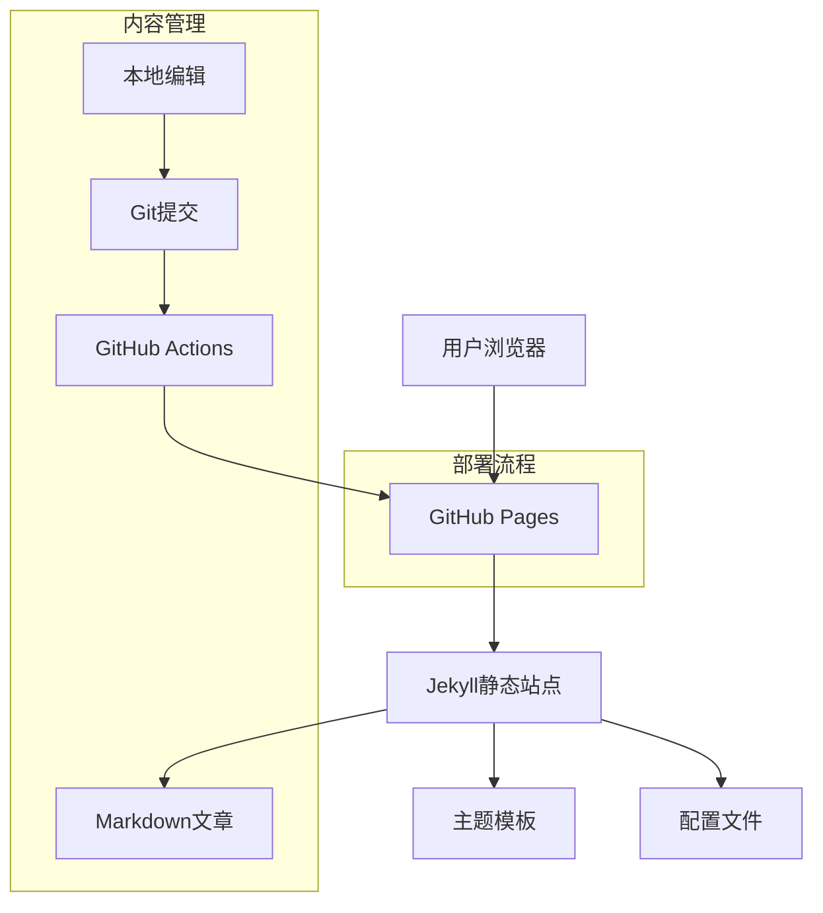

## 1. 架构设计



## 2. 技术描述

- **前端框架**: Jekyll静态站点生成器 + Liquid模板引擎
- **初始化工具**: Jekyll内置初始化
- **后端**: 无（纯静态站点）
- **部署平台**: GitHub Pages
- **版本控制**: Git + GitHub
- **内容格式**: Markdown + YAML前置数据
- **样式框架**: Bootstrap 5 + 自定义CSS
- **动画库**: AOS (Animate On Scroll) + CSS3动画

## 3. 路由定义

| 路由 | 用途 |
|-----|------|
| / | 首页，展示最新博客文章列表 |
| /posts/{slug}/ | 文章详情页，展示单篇文章内容 |
| /categories/{category}/ | 分类页面，按分类筛选文章 |
| /tags/{tag}/ | 标签页面，按标签筛选文章 |
| /about/ | 关于页面，展示个人信息 |
| /archive/ | 归档页面，按时间顺序展示所有文章 |
| /feed.xml | RSS订阅源 |

## 4. 内容管理流程

### 4.1 文章发布流程
1. 在本地使用Markdown编辑器创建新文章
2. 在文章头部添加YAML前置数据（标题、日期、分类、标签等）
3. 将文章文件保存到`_posts`目录
4. 如有图片，保存到`assets/images`目录
5. 提交到GitHub仓库
6. GitHub Actions自动构建并部署到GitHub Pages

### 4.2 文章格式规范
```markdown
---
layout: post
title: "文章标题"
date: 2026-03-17
categories: [技术, 生活]
tags: [前端, React, 教程]
image: /assets/images/post-cover.jpg
description: "文章简短描述"
---

文章内容...
```

## 5. 目录结构

```
├── _config.yml          # Jekyll配置文件
├── _layouts/            # 页面模板
│   ├── default.html     # 默认布局
│   ├── post.html        # 文章布局
│   └── page.html        # 页面布局
├── _includes/           # 可复用组件
│   ├── head.html        # HTML头部
│   ├── header.html      # 导航栏
│   ├── footer.html      # 页脚
│   └── sidebar.html     # 侧边栏
├── _posts/              # 文章目录
│   └── 2026-03-17-hello-world.md
├── _sass/               # Sass样式文件
│   ├── _variables.scss  # 变量定义
│   ├── _base.scss       # 基础样式
│   └── _custom.scss     # 自定义样式
├── assets/              # 静态资源
│   ├── css/            # 样式文件
│   ├── js/             # JavaScript文件
│   └── images/         # 图片文件
├── categories/          # 分类页面
├── tags/               # 标签页面
├── about.md            # 关于页面
└── index.html          # 首页
```

## 6. 配置文件

### 6.1 Jekyll配置(_config.yml)
```yaml
title: "我的个人博客"
description: "记录技术与生活"
baseurl: ""
url: "https://username.github.io"

# 构建设置
markdown: kramdown
highlighter: rouge
theme: minima
plugins:
  - jekyll-feed
  - jekyll-sitemap
  - jekyll-seo-tag

# 分页设置
paginate: 10
paginate_path: "/page:num/"

# 作者信息
author:
  name: "博主姓名"
  email: "email@example.com"
  bio: "个人简介"
  avatar: "/assets/images/avatar.jpg"

# 社交媒体
social:
  github: username
  twitter: username
  linkedin: username
```

### 6.2 插件配置
- **jekyll-feed**: 生成RSS订阅源
- **jekyll-sitemap**: 生成网站地图
- **jekyll-seo-tag**: SEO优化
- **jekyll-paginate**: 文章分页
- **jekyll-archives**: 文章归档

## 7. 性能优化

### 7.1 图片优化
- 使用WebP格式图片，提供JPEG/PNG fallback
- 图片懒加载，减少初始加载时间
- 使用GitHub CDN加速图片访问

### 7.2 代码优化
- CSS和JS文件压缩
- 使用Critical CSS提取关键样式
- 启用Gzip压缩

### 7.3 SEO优化
- 合理的meta标签
- 结构化数据标记
- Open Graph协议支持
- Twitter Cards支持

## 8. 扩展性设计

### 8.1 主题系统
- 支持多主题切换
- 主题配置文件独立
- 可自定义颜色和字体

### 8.2 插件扩展
- 支持自定义Jekyll插件
- 支持第三方评论系统(如Disqus、Gitalk)
- 支持网站统计分析

### 8.3 内容管理增强
- 支持文章系列/专题
- 支持文章置顶功能
- 支持相关文章推荐
- 支持文章搜索功能

## 9. 维护性设计

### 9.1 自动化部署
- GitHub Actions自动构建
- 支持自定义构建脚本
- 自动备份和版本管理

### 9.2 文档规范
- 详细的README文档
- 代码注释规范
- 提交信息规范

### 9.3 监控和统计
- 集成Google Analytics
- 页面加载性能监控
- 错误日志记录